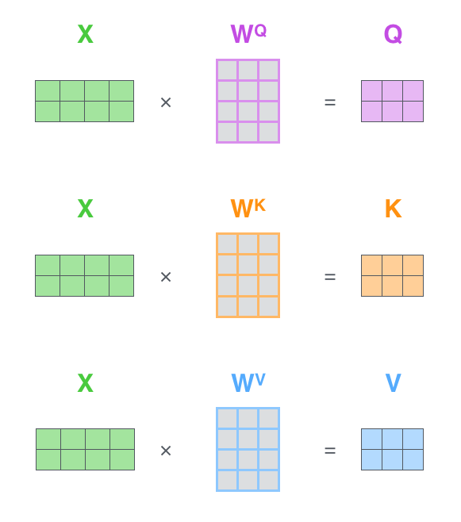

# Attention

> One-sentence intuition: Attention is a mechanism that allows a neural network to dynamically focus on the most relevant parts of the input data when producing an output, much like how humans focus on specific words when translating a sentence or specific objects when describing an image.

## The Core Idea
Before attention, sequence models like RNNs and LSTMs had to compress an entire input sequence into a single, fixed-size vector. This "bottleneck" meant that by the time the model reached the end of a long sequence, it had often forgotten the context from the beginning. 

Attention solves this bottleneck by giving the model access to *all* the past states simultaneously. Instead of relying on a single summary vector, the model calculates a set of "importance weights" (attention scores) for every element in the input sequence. For each step of the output it generates, it looks back at the entire input and softly "attends" to the most relevant pieces. For example, when translating the word "bank" into French, the attention mechanism will heavily weigh context words like "river" or "money" to determine the correct translation, rather than treating all surrounding words equally. This dynamic focus drastically improves the model's ability to handle long-range dependencies and forms the backbone of modern architectures like the Transformer.

## How It Works
The standard paradigm uses a "Query-Key-Value" (Q, K, V) retrieval analogy. Think of searching a database: you issue a **Query** (what you're looking for), the database checks it against **Keys** (labels of the stored items), and returns the corresponding **Values** (the actual data).

In self-attention, every input token generates its own Q, K, and V vectors via learned linear transformations. 
1. **Match:** To find out how much focus word $A$ should pay to word $B$, we take the dot product of word $A$'s Query vector and word $B$'s Key vector. A higher dot product means higher relevance.
2. **Scale & Normalize:** These raw scores are divided by $\sqrt{d_k}$ (the square root of the Key dimension) to keep gradients stable, then passed through a Softmax function so they sum to 1.
3. **Aggregate:** Each word's Value vector is multiplied by its Softmax weight. We sum these up to create the final contextualized representation for word $A$.

**Mathematical Formula:**
$$ \text{Attention}(Q, K, V) = \text{softmax}\left(\frac{QK^T}{\sqrt{d_k}}\right)V $$



```python
# Scaled Dot-Product Attention
scores = torch.matmul(Q, K.transpose(-2, -1)) / math.sqrt(d_k)
weights = torch.softmax(scores, dim=-1)
output = torch.matmul(weights, V)
```

## Interview Angle
Attention is heavily probed in ML interviews.
**What gets asked:** Be ready to explain the Q, K, V analogy clearly. You will frequently be asked *why* we divide by $\sqrt{d_k}$ (Answer: large dot products push the softmax function into regions with extremely small gradients, slowing down learning).
**What trips people up:** Candidates often confuse classic Bahdanau/Luong attention (used with RNNs) and self-attention (used in Transformers). Another pitfall is the computational complexity.
**A great answer:** A standout candidate will mention that self-attention has a time and space complexity of $\mathcal{O}(N^2)$ where $N$ is the sequence length, making it expensive for very long sequences, and might briefly reference modern solutions like FlashAttention or linear attention approximations.

---
*Image credit: [Jay Alammar](http://jalammar.github.io/illustrated-transformer/)*