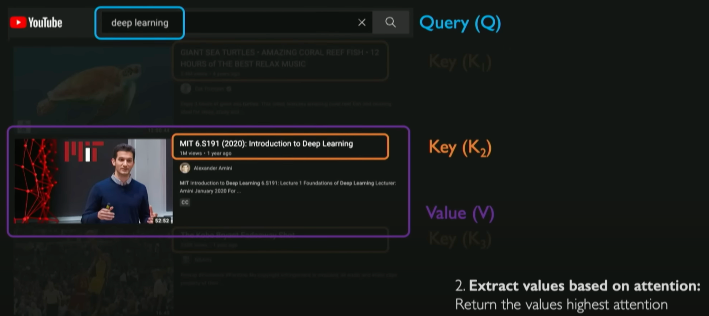
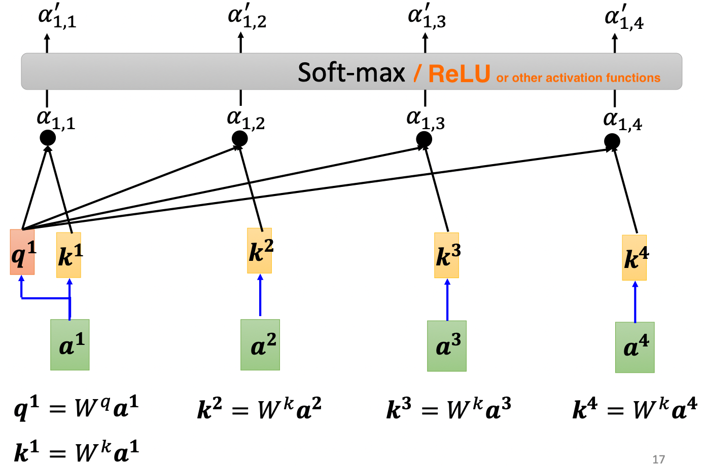
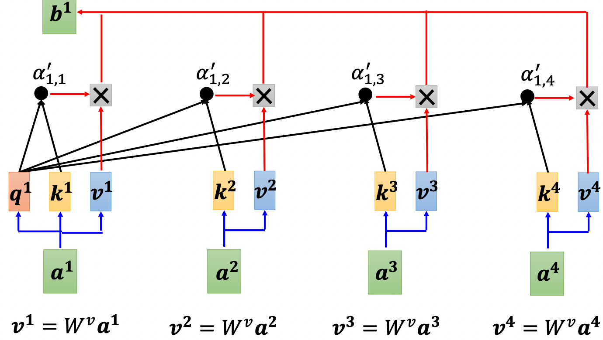

# Attention

> [!TIP]
> Attention lets a model dynamically decide which parts of its input to focus on for each output — instead of compressing everything into a single fixed vector.

## The Core Idea

Before attention, sequence models like RNNs had to compress an entire input sequence into one fixed-size vector before decoding. For long sequences, this bottleneck caused catastrophic forgetting: by the time the model reached the end of a sentence, early context was largely gone.

Bahdanau et al. (2014) broke this constraint in neural machine translation by letting the decoder consult *all* encoder hidden states at each decoding step, weighting them by relevance rather than picking just one. Vaswani et al. (2017) then generalized this idea in "Attention Is All You Need": replace recurrence entirely with **self-attention**, where every token attends to every other token simultaneously. This enabled full sequence parallelism (unlike sequential RNNs) and direct long-range dependency modeling without gradient degradation across many steps.

The core intuition: for each output position, attention computes a dynamic weighted sum over all input representations. Weights are calculated on-the-fly based on relevance. Translating "bank" in "she sat on the bank of the river," the model up-weights "river" and down-weights everything else — without any hand-coded rules.

  
   
  <em>Source: <a href="https://youtu.be/ySEx_Bqxvvo?si=bk2pHfvfDZo8LPRB">MIT 6.S191 (2023): Recurrent Neural Networks, Transformers, and Attention</a></em>

## How It Works

The standard mechanism is **scaled dot-product attention** using a Query-Key-Value (Q, K, V) framework. Think of a database lookup: you send a **Query** (what you want), it's matched against **Keys** (index labels), and the corresponding **Values** (actual data) are returned in proportion to the match score.

Given an input matrix $X$, three learned weight matrices project it into Q, K, and V:

$$
Q = XW^Q, \quad K = XW^K, \quad V = XW^V
$$

Attention then runs in four steps:
1. **Score:** Compute pairwise relevance via dot product: $QK^T$. High dot product = high alignment.
2. **Scale:** Divide by $\sqrt{d_k}$ to prevent large magnitudes that push softmax into vanishing-gradient territory. (When vectors have unit variance, their dot product has variance $d_k$ — scaling restores unit variance.)
3. **Normalize:** Apply softmax so each query's scores sum to 1.
4. **Aggregate:** Multiply by $V$ for a weighted sum of values — one context vector per query position.

$$
\text{Attention}(Q, K, V) = \text{softmax}\!\left(\frac{QK^T}{\sqrt{d_k}}\right)V
$$

  
  
   
  <em>Source: <a href="https://youtu.be/hYdO9CscNes?si=lDa78MvQLqKggntK">【機器學習2021】自注意力機制 (Self-attention) (上)</a></em>

In practice, Transformers use **multi-head attention**: $h$ parallel heads each learn *different* projections, capturing diverse relationship types (syntactic, semantic, positional). Outputs are concatenated and linearly projected back:

$$
\text{MultiHead}(Q, K, V) = \text{Concat}(\text{head}_1, \ldots, \text{head}_h)\,W^O
$$

## Interview Angle

**What gets asked:** "Walk me through scaled dot-product attention." Expect to derive the formula step-by-step and explain *why* we divide by $\sqrt{d_k}$. You may also be asked to contrast Bahdanau attention (additive, decoder-to-encoder, 2014) with self-attention (multiplicative, every-token-to-every-token, 2017).

**What trips people up:** Claiming attention weights are a reliable window into model reasoning. They correlate with relevance but don't fully explain decisions — information is further transformed through subsequent feed-forward layers and residual connections. Also: forgetting that self-attention is permutation-invariant and *requires* positional encodings to understand word order.

**A great answer:** Self-attention has $\mathcal{O}(N^2)$ time and memory complexity in sequence length $N$, creating a hard wall for long contexts. The dominant production solution is FlashAttention (2022): it computes the *exact* same result but avoids materializing the full $N \times N$ attention matrix in HBM by using IO-aware tiling across GPU SRAM. This yields 2–4× wall-clock speedup and linear memory usage — same math, fundamentally different memory access pattern.
