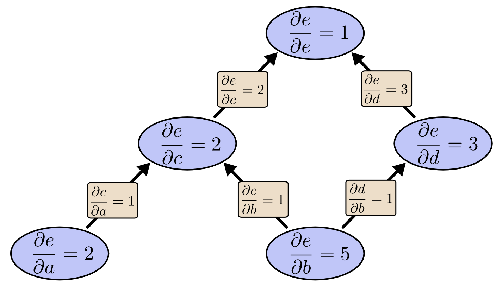
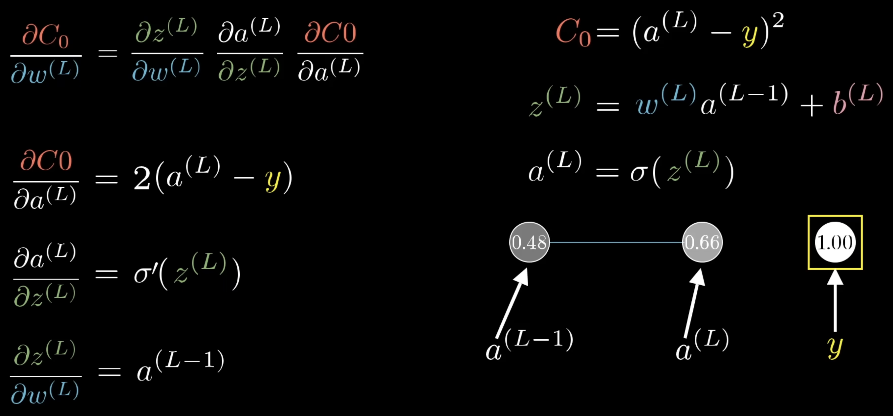

# Backpropagation

> [!TIP]
> Backpropagation applies the chain rule in reverse through a computation graph, computing the gradient of the loss with respect to every weight in a single backward pass — instead of one forward pass per weight.

## The Core Idea

Training a neural network is an optimization problem: find the weights that minimize a loss $C$. After a forward pass produces a prediction, we know how wrong the network was. The hard part is figuring out how much each of potentially millions of weights contributed to that error — the **credit-assignment problem**.

The brute-force approach nudges each weight by $\epsilon$ and reruns the forward pass to measure the change in loss. For $N$ parameters, that's $N$ forward passes per update: completely intractable.

Backpropagation solves this in a single backward pass. A neural network is a nested composite function, so the chain rule lets us decompose $\partial C / \partial w$ into products of cheap local derivatives. Each local derivative can be computed from activations already cached during the forward pass. The backward pass visits each node exactly once, propagating a gradient signal from the output back to the inputs.

One critical distinction: **backpropagation only computes gradients**. It does not update weights. That job belongs to an optimizer (SGD, Adam, etc.). Conflating the two is the most common interview mistake.

  
  
   
  <em>Source: <a href="https://colah.github.io/posts/2015-08-Backprop/">Colah's Blog — Calculus on Computational Graphs: Backpropagation</a></em>

## How It Works

**Start with one weight.** Suppose a network has a single chain: input $x$ → weight $w_1$ → hidden $h$ → weight $w_2$ → loss $C$. How does $w_1$ affect $C$? By the chain rule:

$$
\frac{\partial C}{\partial w_1} = \frac{\partial C}{\partial h} \cdot \frac{\partial h}{\partial w_1}
$$

That's backprop in miniature: multiply the "how much does the loss care about $h$" signal (coming from the right) by the "how much does $w_1$ control $h$" signal (local). Backpropagation scales this to every weight in the network simultaneously.

  
   
  <em>Source: <a href="https://youtu.be/tIeHLnjs5U8?si=Qsnr7U4syIIXLLRx">3Blue1Brown — Backpropagation calculus | Deep Learning Chapter 4</a></em>

**Two passes, four equations.** Let $z^l = w^l a^{l-1} + b^l$ be the pre-activation at layer $l$, and $a^l = \sigma(z^l)$ the output after activation. The key intermediate is the **error signal** $\delta^l \equiv \partial C / \partial z^l$ — how sensitive the loss is to the raw input of each layer.

1. **Seed at the output** *(how wrong were we, scaled by the output activation's slope)*

$$
\delta^L = \nabla_a C \odot \sigma'(z^L)
$$

2. **Pass the signal backward** *(route through transposed weights, gate by the activation slope at this layer)*

$$
\delta^l = \left((w^{l+1})^T \delta^{l+1}\right) \odot \sigma'(z^l)
$$

3. **Read off the gradients** *(once every $\delta^l$ is known, weights and biases are one multiply away)*

$$
\frac{\partial C}{\partial w_{jk}^l} = a_k^{l-1} \cdot \delta_j^l \qquad \frac{\partial C}{\partial b_j^l} = \delta_j^l
$$

The weight gradient (step 3) is "what came in from the layer below" × "the error signal from the layer above." If the neuron below is inactive ($a_k^{l-1} \approx 0$), the weight gets a near-zero gradient no matter the loss — this is the **dead neuron** problem with ReLU.

## Interview Angle

**What gets asked:** "Walk me through backprop for a single fully-connected layer." You may also be asked how activation function choice (sigmoid vs. ReLU) affects gradient flow, and what the vanishing gradient problem is.

**What trips people up:** Saying "backpropagation updates the weights." Backprop computes $\nabla_w C$; the optimizer uses those gradients to update weights. A second error: thinking backprop is neural-network-specific. It's reverse-mode automatic differentiation on any computation graph.

**A great answer:** Reverse-mode autodiff costs one pass per *output*; forward-mode costs one pass per *input*. A neural network has $N$ parameters (inputs to the loss) but only one scalar output. So reverse-mode computes the full gradient in one backward pass; forward-mode would need $N$ passes — one per parameter. That factor-of-$N$ difference is why training deep networks is computationally feasible at all.