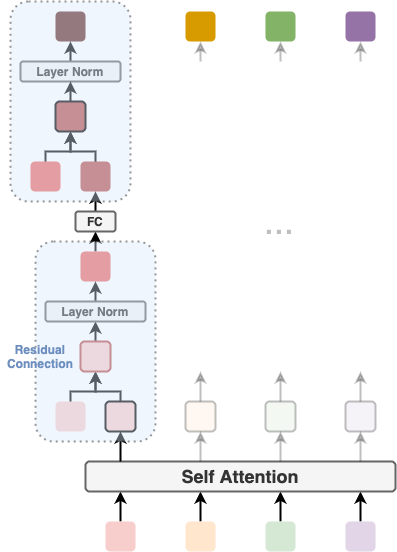
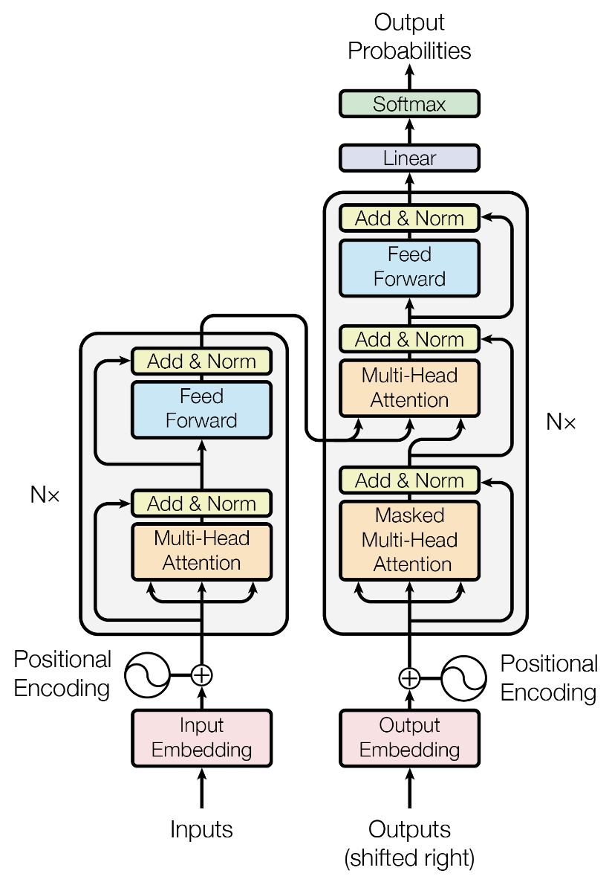

# Transformer

> [!TIP]
> The Transformer replaces recurrent sequence processing with self-attention over the entire sequence at once, enabling full parallelism and direct modeling of long-range dependencies.

## The Core Idea

Before the Transformer, sequence models like RNNs and LSTMs processed tokens one by one, left to right. This sequential constraint had two fundamental costs: training couldn't be parallelized across time steps, and long-range dependencies had to survive many intermediate steps — making them fragile for long sequences.

Vaswani et al. (2017) in *"Attention Is All You Need"* discarded recurrence entirely. Their insight: if self-attention lets every token attend directly to every other token simultaneously, you get two things for free. First, full parallelism — all positions are computed in one matrix multiply, not N sequential steps. Second, constant-distance dependency modeling — "bank" can directly attend to "river" regardless of how many tokens separate them, with no gradient path through intermediate states.

This architectural shift had compounding consequences. Training speeds increased enough to scale models to billions of parameters, which in turn unlocked emergent capabilities that smaller sequential models never exhibited. Every major modern LLM (GPT, BERT, LLaMA) is a Transformer.

## How It Works

The original Transformer stacks $N=6$ encoder layers and $N=6$ decoder layers. Each layer wraps its sub-layers with residual connections and Layer Normalization:

$$
\text{output} = \text{LayerNorm}(x + \text{Sublayer}(x))
$$

  

**Encoder** (each of N layers):
1. **Multi-Head Self-Attention** — every token attends to every other token bidirectionally.
2. **Position-wise Feed-Forward Network** — a two-layer MLP applied independently to each position.

**Decoder** (each of N layers) adds a third sub-layer between the two above:
- **Masked Self-Attention** — tokens can only attend to earlier positions (masking prevents looking ahead during autoregressive generation).
- **Cross-Attention** — queries come from the decoder, keys and values come from the encoder output.

**Positional Encoding** — because self-attention is permutation-invariant, the model has no inherent sense of order. Sinusoidal encodings are added to the input embeddings before the first layer.

  
   
  <em>Source: <a href="https://arxiv.org/abs/1706.03762">Vaswani et al., "Attention Is All You Need" (2017)</a></em>

## Interview Angle

**What gets asked:** "Walk me through the encoder vs. decoder" (bidirectional vs. masked + cross-attention). "Why do we need positional encodings?" (self-attention is permutation-invariant — without them, "cat sat on mat" and "mat on sat cat" are identical inputs). "What's the complexity of self-attention?" ($\mathcal{O}(N^2 \cdot d)$ in time and $\mathcal{O}(N^2)$ in memory).

**What trips people up:** Conflating self-attention with cross-attention, or forgetting the masking in the decoder entirely. Another common gap: not knowing that encoder-only models (BERT) and decoder-only models (GPT) are both Transformers — the encoder-decoder structure is just one variant.

**A great answer:** An exceptional candidate will discuss the time complexity tradeoff. While recurrent models process in $\mathcal{O}(N)$ sequence steps, self-attention has a computational complexity of $\mathcal{O}(N^2)$ with respect to sequence length. The candidate will explain how this quadratic cost becomes the new bottleneck, smoothly segueing into newer optimizations like FlashAttention or Mixture of Experts (MoE).